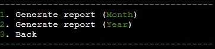

# Smart Budget

[View live project here!](https://smart-budget-48effdb642a1.herokuapp.com/)

Smart Budget is a user-friendly command-line app designed to help users manage their finances efficiently. 
With this app, you can set spending limits for different categories, keep track of your transactions, and generate detailed financial reports. 
Built with Python, it integrates with Google Sheets to store your data, ensuring it's always safe and easy to access.

__Note:__ Currently, this app is designed for $\color{green}{\textsf{single-user}}$ usage. In future updates, an authentication function will be added to allow multiple users to manage their budgets independently.

To make it as simple as possible for users, the app uses one-letter options to avoid typing long commands and prevent misspellings.
Additionally, the colorama library is used for better visibility and an enhanced user experience.

## Features

### Existing Features

- __Set Budget__
  - Users can set budget limits for $\color{green}{\textsf{predefined}}$ categories (Housing, Transport, Food, Entertainment, Savings).
  - Error handling for invalid inputs and duplicate budget entries.

- __Add Transaction__
  - Allows users to record income and expense transactions.
  - Automatically uses today's date if the user presses enter.
  - Ensures valid input for dates, transaction types, categories, and amounts.
  - Ensures descriptions cannot be left empty.
  - Provides feedback and progress indicators.

- __Update Transaction__
  - Users can update existing transactions by specifying the date.
  - Handles invalid date formats and non-numeric amounts.
  - Allows changing transaction type, category, amount, and description.

- __Delete Transaction__
  - Lists all transactions for a specified date.
  - Allows the user to select which transaction to delete.
  - Includes a confirmation message before deletion.

- __View Transactions__
  - Displays all transaction records.
  - Uses color coding for enhanced readability.

- __Generate Report__
  - Provides a summary of income, expenses, and savings.
  - Compares spending against budget limits.
  - Uses color coding for a better user experience.

### Features to be Added

- __Budget Categories__
  - Allow users to define custom categories.

- __User Authentication__
  - Add authentication to enable multiple users to manage their budgets independently.

- __Notifications and Alerts__
  - Set up notifications and alerts for budget limits, upcoming bills, and low balances.

- __Advanced Search and Filter__
  - Enhance the search and filter options to allow users to find specific transactions easily.

## Technologies Used

- __Python__: Main programming language.
- __gspread__: To interact with Google Sheets.
- __Google OAuth__: For authentication.
- __Colorama__: For colored terminal output.
- __Datetime__: For date verification.

## Testing 

| Action | Result | Pass or Fail |
| :-: | :-: | :-: |
| Open application | Welcome message displayed | ✅ |
| Set budget with valid input | Budget set successfully | ✅ |
| Set budget with invalid input | Error message displayed | ✅ |
| Add transaction with valid input | Transaction added successfully | ✅ |
| Add transaction with invalid input | Error message displayed | ✅ |
| Update transaction with valid input | Transaction updated successfully | ✅ |
| Update transaction with invalid input | Error message displayed | ✅ |
| Delete transaction with valid date | Transaction deleted successfully | ✅ |
| Delete transaction with invalid date | Error message displayed | ✅ |
| View transactions (Month) | Transactions displayed | ✅ |
| View transactions (Year) | Transactions displayed | ✅ |
| Generate report (Month) | Report displayed successfully | ✅ |
| Generate report (Year) | Report displayed successfully | ✅ |

## Bugs

### Solved Bugs

- __Date Format Error__: Invalid date formats were causing incorrect inputs. Added error handling to ensure dates are in the correct format.
- __Budget Set__: When setting a budget, duplicates were being created. This was fixed by checking for existing budgets before adding new ones or overwriting old ones.
- __Incorrect Amount Inputs__: Users could input non-numeric or negative values for transaction amounts. Added validation to ensure only positive numeric values are accepted.
- __Transaction Deletion Confirmation__: Transactions were deleted without confirmation. Added a confirmation prompt to prevent accidental deletions.

### Unfixed Bugs

- No known unfixed bugs.

## Validator Testing

- __Python Linter__: No errors found when passing through PEP8 linter.
- __gspread__: Ensured no authorization errors with Google Sheets.
- __Colorama__: Verified color output works across different terminal emulators.

## Deployment

The Smart Budget app was deployed on Heroku using [Code Institute P3 template](https://github.com/Code-Institute-Org/p3-template). Follow these steps to deploy the app:

1. __Add Buildpacks__: 
    - Go to the Settings tab of your app on Heroku.
    - Add the following buildpacks in this order:
        1. `heroku/python`
        2. `heroku/nodejs`

2. __Create Config Vars__:
    - In the Settings tab, click on "Reveal Config Vars".
    - Add a Config Var called `PORT` and set its value to `8000`.
    - If you have credentials, create another Config Var called `CREDS` and paste the JSON into the value field.

3. __Connect to GitHub__:
    - In the Deploy tab, connect your GitHub repository to the Heroku app.
    - Select the repository and branch you want to deploy.

4. __Deploy the App__:
    - Scroll down to the "Manual Deploy" section in the Deploy tab.
    - Click "Deploy Branch".

The app should now be deployed and accessible from the [URL](https://smart-budget-48effdb642a1.herokuapp.com/) provided by Heroku.

## Cloning and Forking

### Cloning

- To clone the repository:
  - On GitHub.com, navigate to the main page of the repository.
  - Above the list of files, click Code.
  - Copy the URL for the repository.
  - Type `git clone`, and then paste the URL you copied earlier.
  - Press Enter to create your local clone.

### Forking

- To fork the repository:
  - On GitHub.com, navigate to the main page of the repository.
  - In the top-right corner of the page, click Fork.
  - Under "Owner," select the dropdown menu and click an owner for the forked repository.
  - Click Create fork.

## Development Process

- The development process is documented through regular commits with clear, descriptive messages.
- Each feature or fix has a dedicated commit, ensuring a clear and understandable development history.

## Screenshots

### Main Menu

### Transactions

### Generate Report

## Credits

### Content

- The application logic and code were written by me with the help of resources found online:
- Primarily through [Google](https://www.google.com/) searches, [Code Institute](https://codeinstitute.net/) training material and documentation for `datetime` and `colorama`.

### Media

- No media files were used in this project.

## Acknowledgements

- Special thanks to the instructors and mentors from [Code Institute](https://codeinstitute.net/) for their guidance and support.
- Thanks to the contributors of the libraries used: `gspread`, `google-auth`, `datetime` and `colorama`.

## Project Rationale

This project was developed to provide users with a simple yet powerful tool for managing their finances. The goal was to create an application that is easy to use, integrates seamlessly with Google Sheets for data storage, and provides meaningful financial insights through detailed reports. The Smart Budget app aims to help users maintain control over their spending and achieve their financial goals.
